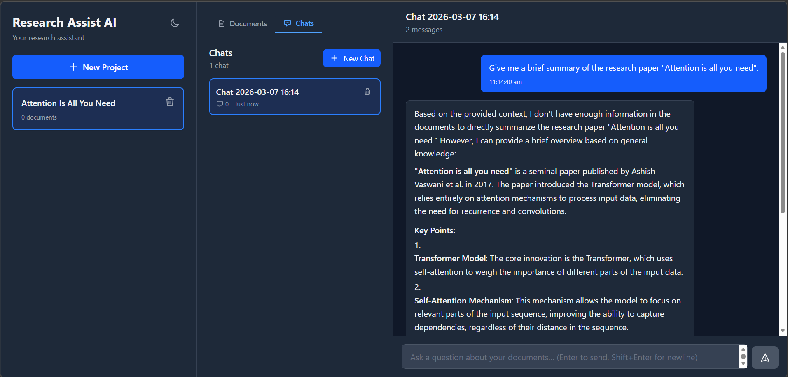

# Research Assist AI



This project was initiated as an experiment to help me get familiar with AI-assisted software development. Timeline and observations have been recorded to the best of my knowledge in AUTHOR-NOTES.md.

## Overview

> AI-powered research assistant for document analysis and Q&A

A full-stack application that enables researchers to upload documents (PDFs), ingest and process them using advanced NLP techniques, and interact with the content through an intelligent chat interface powered by retrieval-augmented generation (RAG).

## 🎯 Project Status

**All implementation phases complete** — 234 backend tests passing

- ✅ Phase 1: Project scaffolding and development environment
- ✅ Phase 2: Core abstractions, models, and configuration
- ✅ Phase 3: Project Management Service (CRUD API + Frontend)
- ✅ Phase 4: Document Ingestion Pipeline
- ✅ Phase 5: Chat Service & RAG
- ✅ Phase 6: Integration, Polish & Testing
- ✅ Phase 7: Terraform & Deployment
- ✅ Post-deployment fixes: message ordering (timestamp-prefixed DynamoDB sort keys), RAG context window (128k configurable)
- ✅ Post-development: Dark mode with system preference detection and localStorage persistence

## 🏗️ Architecture

### Tech Stack

**Backend:**
- Python 3.12+ with FastAPI
- SQLAlchemy 2.0 (async ORM) with asyncpg
- PostgreSQL 16 with pgvector extension
- Redis for task queue broker
- Celery for async document processing
- AWS Bedrock — Amazon Nova Micro (LLM) + Titan Embeddings V2 (1024-dim)
- DynamoDB for chat message history (via LocalStack locally)
- S3 for document storage (via LocalStack locally)
- tiktoken for token counting and budget management

**Frontend:**
- React 19 with TypeScript 5.9
- Vite 7.3 for development and builds
- Tailwind CSS v4.1 with class-based dark mode
- React Context + useReducer for state management
- react-markdown + remark-gfm for chat message rendering
- Axios for API communication

**Infrastructure:**
- Docker Compose for local development (5 services)
- LocalStack for local AWS services (DynamoDB, S3)
- AWS for production (S3, Bedrock, DynamoDB)
- Terraform for infrastructure as code

### Project Structure

```
research-assist-ai/
├── backend/                    # Python FastAPI backend
│   ├── app/
│   │   ├── core/              # Configuration, interfaces (abstract base classes)
│   │   ├── db/                # Database setup (PostgreSQL, DynamoDB)
│   │   ├── models/            # SQLAlchemy ORM models
│   │   ├── schemas/           # Pydantic request/response schemas
│   │   ├── repositories/      # Data access layer (project, document, chunk, chat)
│   │   ├── services/          # Business logic (chat, document, chunking, retrieval, prompts)
│   │   ├── implementations/   # Concrete implementations (Bedrock, PGVector, Titan, PDF parsers)
│   │   ├── routers/           # API endpoints (projects, documents, chats, admin)
│   │   └── worker/            # Celery app and async tasks
│   ├── tests/                 # 234 backend tests (20 test files)
│   ├── alembic/               # Database migrations
│   ├── config.yaml            # Application configuration
│   └── pyproject.toml         # Python dependencies
├── frontend/                   # React TypeScript frontend
│   ├── src/
│   │   ├── components/        # 14 React components (incl. ThemeToggle)
│   │   ├── context/           # State management (AppContext, ThemeContext, ToastContext)
│   │   ├── api/               # API client (projects, documents, chats)
│   │   └── types/             # TypeScript type definitions
│   └── package.json
├── design/                     # Design documents
│   └── phase-1/
│       ├── requirement-specification.md
│       ├── design-doc.md
│       ├── implementation-plan.md
│       ├── implementation-standards.md
│       └── implementation-issues.md
├── docker/                     # Database init scripts
│   └── init-db.sql
└── docker-compose.yml          # Local dev environment
```

## 🚀 Getting Started

### Prerequisites

- Python 3.12+
- Node.js 20+
- Docker and Docker Compose
- AWS CLI configured (for production)
- [uv](https://github.com/astral-sh/uv) — Fast Python package manager

### Installation

1. **Clone the repository:**
   ```bash
   git clone <repository-url>
   cd research-assist-ai
   ```

2. **Start infrastructure services with Docker Compose:**
   ```bash
   docker-compose up -d
   ```

   This starts:
   - PostgreSQL with pgvector (port 5432)
   - Redis (port 6379)
   - LocalStack — DynamoDB + S3 (port 4566)
   - Backend API (port 8000)
   - Celery worker (document processing)

3. **Run database migrations:**
   ```bash
   cd backend
   uv run alembic upgrade head
   ```

4. **Start the frontend dev server:**
   ```bash
   cd frontend
   npm install
   npm run dev
   ```

5. **Access the application:**
   - Frontend: http://localhost:5173
   - Backend API: http://localhost:8000
   - API Docs: http://localhost:8000/docs

### Local Development (without Docker)

**Backend:**
```bash
cd backend
uv sync                           # Install dependencies
uv run alembic upgrade head       # Run migrations
uv run uvicorn app.main:app --reload  # Start dev server
```

**Frontend:**
```bash
cd frontend
npm install                       # Install dependencies
npm run dev                       # Start dev server (port 5173)
```

**Infrastructure services only:**
```bash
docker-compose up postgres redis localstack
```

## 🧪 Testing

### Backend Tests

```bash
cd backend
uv run pytest                     # Run all 234 tests
uv run pytest -v                  # Verbose output
uv run pytest tests/test_projects_api.py  # Specific test file
uv run pytest --cov=app          # With coverage report
```

### Type Checking and Linting

**Frontend:**
```bash
cd frontend
npx tsc --noEmit                  # TypeScript type checking
npm run lint                      # ESLint
npm run build                     # Full build (type check + bundle)
```

## 📚 Documentation

- [Requirement Specification](design/phase-1/requirement-specification.md)
- [Design Document](design/phase-1/design-doc.md)
- [Implementation Plan](design/phase-1/implementation-plan.md)
- [Implementation Standards](design/phase-1/implementation-standards.md)
- [Implementation Issues](design/phase-1/implementation-issues.md)

## 🔑 Key Features

- **Project Management**: Create and manage research projects with metadata
- **Document Upload**: Upload PDF documents with automatic S3 storage
- **Intelligent Processing**: Automatic PDF parsing (PyMuPDF4LLM + pdfplumber fallback), recursive chunking, and vector embedding via Celery workers
- **Hybrid Search**: Combines pgvector cosine similarity and PostgreSQL tsvector BM25 with configurable weights
- **AI Chat Interface**: Interactive Q&A with Server-Sent Events (SSE) streaming responses
- **Source Citations**: Every answer includes references to source document chunks
- **Chat History**: Persistent conversation history in DynamoDB with context summarization
- **Conversation Memory**: Automatic conversation folding and summarization to stay within token budgets
- **Dark Mode**: Sun/Moon toggle with system preference detection and localStorage persistence
- **Admin Tools**: Bulk re-embedding endpoint for updating stale vector embeddings

## ⚙️ Configuration

Application behavior is configured via `backend/config.yaml`:

| Section | Key Settings |
|---------|-------------|
| **chunking** | `chunk_size_tokens: 800`, `overlap_tokens: 150`, recursive strategy with markdown-aware separators |
| **retrieval** | `top_k: 5`, `similarity_threshold: 0.7`, hybrid search (`bm25_weight: 0.3`, `vector_weight: 0.7`) |
| **memory** | `recent_message_count: 10`, `batch_fold_size: 5`, summarization via Nova Micro |
| **embedding** | Amazon Titan Embed Text V2, 1024 dimensions |
| **llm** | Amazon Nova Micro, `context_window: 128000`, `temperature: 0.3` |
| **document_processing** | PDF only, 50 MB max, PyMuPDF4LLM primary with pdfplumber fallback |

## 🛠️ Development Workflow

### Creating Database Migrations

```bash
cd backend
uv run alembic revision --autogenerate -m "Description of changes"
uv run alembic upgrade head
```

### Building for Production

**Backend:**
```bash
cd backend
docker build -t research-assist-backend .
```

**Frontend:**
```bash
cd frontend
npm run build
# Output in dist/
```

## 📋 API Endpoints

### Health & Config

- `GET /api/health` — Health check
- `GET /api/config` — Non-sensitive application configuration

### Projects

- `POST /api/projects` — Create a new project
- `GET /api/projects` — List all projects (paginated: `limit`, `offset`)
- `GET /api/projects/{project_id}` — Get project details
- `PUT /api/projects/{project_id}` — Update project
- `DELETE /api/projects/{project_id}` — Delete project (cascade)

### Documents

- `POST /api/documents/upload` — Upload a PDF document
- `GET /api/documents/{document_id}` — Get document details
- `GET /api/documents/{document_id}/status` — Get processing status
- `GET /api/projects/{project_id}/documents` — List documents for a project
- `POST /api/projects/{project_id}/documents` — Link a document to a project
- `DELETE /api/projects/{project_id}/documents/{document_id}` — Unlink a document from a project

### Chat

- `POST /api/projects/{project_id}/chats` — Create a chat session
- `GET /api/projects/{project_id}/chats` — List chat sessions for a project
- `GET /api/chats/{chat_id}` — Get a chat session
- `DELETE /api/chats/{chat_id}` — Delete a chat session and its messages
- `POST /api/chats/{chat_id}/messages` — Send a message (SSE streaming response)
- `GET /api/chats/{chat_id}/messages` — Get message history (paginated)

### Admin

- `POST /api/admin/re-embed` — Trigger bulk re-embedding of stale chunks
- `GET /api/admin/re-embed/status` — Check re-embedding progress

## 📝 License

MIT
